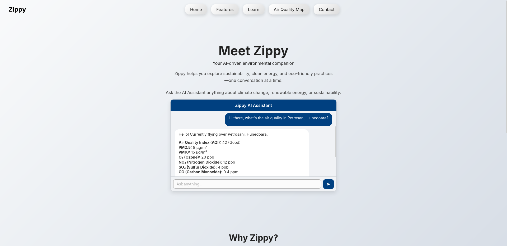

# **Zippy – Autonomous Delivery and Air Quality Drone with AI Assistant**

**Zippy** is an advanced drone platform engineered to **deliver lightweight packages** and **monitor air quality** in real time. It features an AI-powered web interface for data visualization, operational control, and user support. The system integrates environmental sensing, GPS mapping, GSM communication, and an AI chatbot assistant (OpenAI’s GPT) to streamline deliveries, alerts, and environmental analysis.

---

## **Use Cases**

- **Autonomous delivery** of food or small packages  
- **Real-time air quality mapping** (NO₂, VOCs, temperature, humidity)  
- **Smart city environmental monitoring**  
- **AI chatbot** for delivery status and pollution insights  

---

## **Architecture Overview**

ZIPPY DRONE SYSTEM

┌──────────────────────────────┐
│         Drone Hardware       │
│                              │
│  ┌────────────────────────┐  │
│  │ Arduino UNO            │◄─┐
│  │ • Sensor data          │  │
│  │ • Actuator control     │  │
│  └────────────────────────┘  │
│                              │
│  ┌────────────────────────┐  │
│  │ SIM800C GSM Module     │──┘
│  │ • Data transmission    │
│  └────────────────────────┘  │
└──────────────────────────────┘

WEB SERVER (Apache2 + PHP)

┌──────────────────────────────┐
│ PHP Backend                 │
│ • REST API endpoints        │
│ • OpenAI ChatGPT proxy      │
│ • WebSocket (Ratchet/PHP)   │
├──────────────────────────────┤
│ MySQL Database (separate)   │
└──────────────────────────────┘

CLIENT INTERFACE

┌──────────────────────────────┐
│ **Web Dashboard**           │
│ (Leaflet.js + Chart.js)     │
│ • Live drone location        │
│ • Air quality visualizations │
│ • AI Chatbot (OpenAI API)    │
└──────────────────────────────┘

┌──────────────────────────────┐
│ **Mobile App**              │
│ (Flutter)                   │
│ • Real-time alerts           │
│ • Delivery tracking          │
└──────────────────────────────┘


---

## **Technology Stack**

### **Drone Hardware**

- **Arduino UNO** — Sensor acquisition, actuator control, data formatting  
- **SIM800C GSM module** — GSM/GPRS communication (TCP/IP, SMS)  
- **Sensors**  
  - **MQ-135** (volatile organic compounds)  
  - **NO₂ electrochemical sensor**  
  - **DHT22** (temperature and humidity)  
  - **NEO-6M GPS module**  
  - **HC-SR04W** ultrasonic waterproof obstacle detector  
- **Actuators**  
  - Standard **servomotors** (sensor head rotation, delivery mechanism)  
  - **Stepper motor** with driver (compartment door)  

### **Software & Web**

- **Apache2** — HTTP server hosting PHP application  
- **PHP 7.4+** — Backend logic, OpenAI proxy, WebSocket support via Ratchet or similar  
- **MySQL** — Separate database server for telemetry, location, delivery logs  
- **Leaflet.js & Chart.js** — Interactive map and real-time sensor graphing  
- **Flutter** — Cross-platform mobile application for live tracking and notifications  
- **OpenAI API (ChatGPT)** — Integrated AI assistant on the web interface  

---

## **Features**

- Fully autonomous drone operation  
- Real-time delivery and sensor tracking via web dashboard  
- Comprehensive air quality logging and heatmap generation  
- Integrated AI chatbot assistant for delivery support and environmental queries  
- Delivery logging, command center, and alerting (SMS, WebSocket)  
- Solar-assisted power system (LiFePO₄ battery with flexible panel)  
- Modular and scalable hardware design  

---

## **Website Features**

- **Live map** with drone position and pollution heatmap  
- **Sensor data charts** for NO₂, VOCs, temperature, and humidity  
- **AI assistant** powered by OpenAI’s ChatGPT for user guidance  
- **Mobile-friendly** dashboard and push notifications  

---



## **Installation & Deployment**

### **1. Arduino UNO Firmware**

1. Open **Arduino IDE** (or PlatformIO).  
2. Load `firmware.ino` from the `arduino/` directory.  
3. Wire modules:  
   - **DHT22** → digital input  
   - **MQ-135**, **NO₂ sensor** → analog inputs  
   - **NEO-6M GPS** → serial interface (SoftwareSerial)  
   - **SIM800C** → serial interface (SoftwareSerial)  
4. Set the server API endpoint in the sketch (HTTP POST).  
5. Upload firmware to the Arduino UNO.

### **2. MySQL Database Server**

1. Install MySQL on a dedicated host or container.  
2. Create database and user:

    ```sql
    CREATE DATABASE zippy;
    CREATE USER 'zippy_user'@'%' IDENTIFIED BY 'strong_password';
    GRANT ALL PRIVILEGES ON zippy.* TO 'zippy_user'@'%';
    FLUSH PRIVILEGES;
    ```
3. Import schema:

    ```bash
    mysql -u zippy_user -p zippy < docs/schema.sql
    ```

### **3. Apache2 + PHP Backend**

1. Install Apache2, PHP, and required extensions (cURL, PDO_MySQL, JSON, WebSocket library).  
2. Configure virtual host:

    ```apache
    <VirtualHost *:80>
      ServerName zippy.example.com
      DocumentRoot /var/www/zippy
      <Directory /var/www/zippy>
        AllowOverride All
        Require all granted
      </Directory>
      ErrorLog ${APACHE_LOG_DIR}/zippy_error.log
      CustomLog ${APACHE_LOG_DIR}/zippy_access.log combined
    </VirtualHost>
    ```
3. Enable and restart:

    ```bash
    a2enmod rewrite proxy_fcgi setenvif
    systemctl restart apache2
    ```
4. Deploy PHP files into `/var/www/zippy`, configure `config.php` with:
    ```php
    <?php
    return [
      'db_host'     => 'your_mysql_host',
      'db_name'     => 'zippy',
      'db_user'     => 'zippy_user',
      'db_pass'     => 'strong_password',
      'openai_key'  => 'sk-...',
    ];
    ```

### **4. Client Dashboard**

1. Copy `client/` into `/var/www/zippy/client/`.  
2. Edit `client/main.js` to point to your backend API and WebSocket endpoints.

### **5. Flutter Mobile Application**

1. Open the `mobile/` folder in Android Studio or VS Code.  
2. Set API endpoint and OpenAI key in `lib/config.dart`.  
3. Install dependencies and run:

    ```bash
    flutter pub get
    flutter run
    ```

---

## **OpenAI ChatGPT Integration**

1. Sign up at [OpenAI](https://platform.openai.com/) and generate an API key.  
2. Store your key in `config.php` and/or `.env` if used.  
3. The PHP backend will forward chat requests to OpenAI and return responses.

---

## **Project Structure**

zippy-drone/
│
├── arduino/ # Arduino UNO firmware
├── docs/ # Schematics, SQL schema, documentation
├── server/ # PHP backend (API, WebSocket)
├── client/ # Web UI (static files)
├── mobile/ # Flutter mobile application
├── LICENSE
└── README.md


---

## **Roadmap**

- Web dashboard enhancements  
- Additional sensor support (PM2.5, CO)  
- HTTPS (Let's Encrypt) and secure API endpoints  
- Edge AI processing for anomaly detection  

---

## **Contributors**

- **Alexandru Moroșanu** — Lead Developer & Project Manager  
- **Darius Bogdan Andrei** — Hardware Integration & Sensors  
- **Zippy Robotics Team**

---

## **License**

This project is licensed under the **MIT License**. See the [LICENSE](LICENSE) file for details.  

